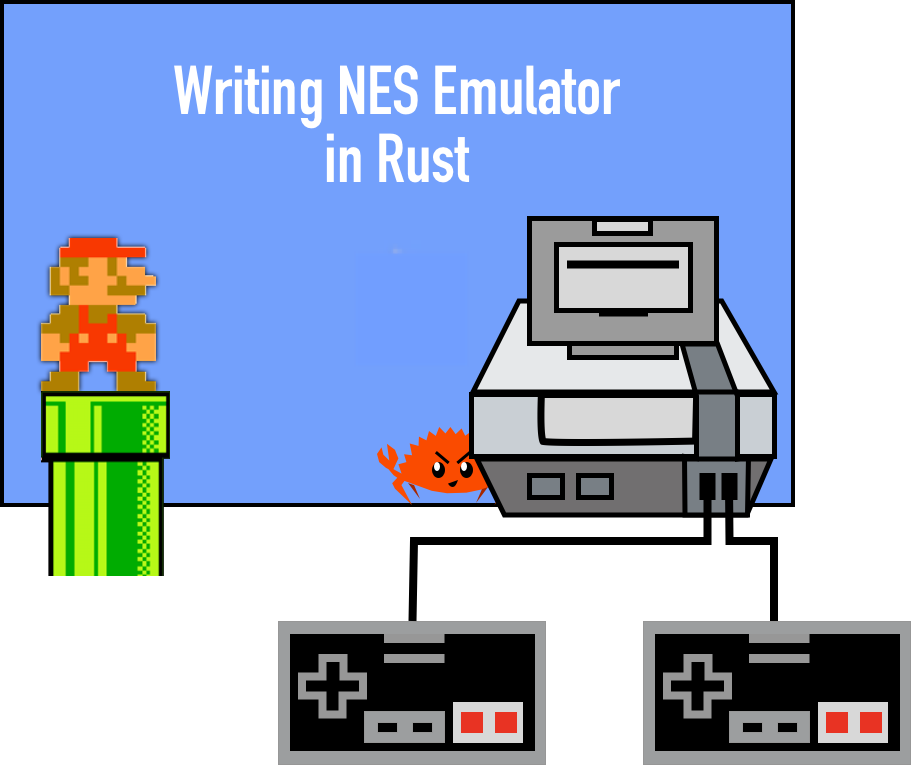
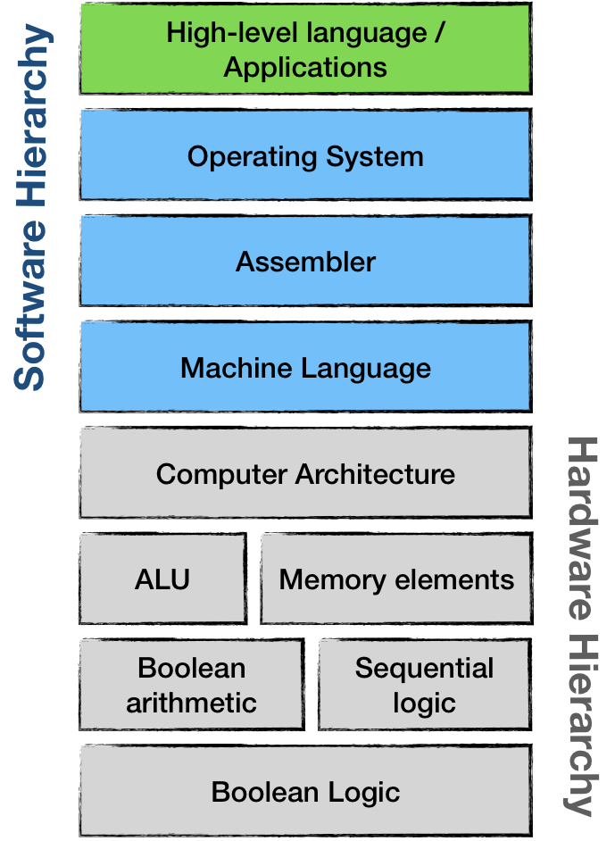

<div align="center">

# **NES emulator in Rust**



</div>

#

## The simplified architecture of hardware-software interaction looks like this

<div align="center">



</div>

#

### To start the emulator, enter

```console
cargo run
```

### To compile

```console
cargo build
```

#

### Dependencies

* Rust 1.65.0
* Cargo 1.65.0
* Crates (in [Cargo.toml](Cargo.toml))
  * lazy_static
  * bitflags
  * sdl2
  * rand

#

<div align="right">

##### *Inspired by [Rafael Bagmanov](https://bugzmanov.github.io/)*

</div>
